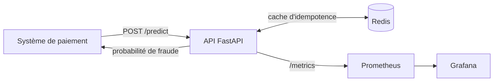
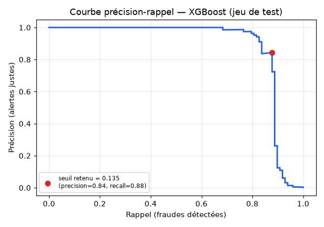
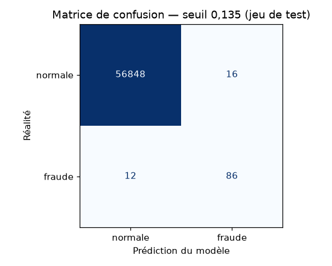

# Détection de fraude bancaire en temps réel

Un système complet qui score une transaction par carte et répond, en quelques
millisecondes, si elle est frauduleuse — de l'exploration des données jusqu'au
déploiement conteneurisé avec cache et monitoring.

> **Démo interactive** : _(lien à ajouter après déploiement)_
> **Données** : [Credit Card Fraud Detection](https://www.kaggle.com/datasets/mlg-ulb/creditcardfraud) (Kaggle) — 284 807 transactions réelles, 492 fraudes.

---

## Le problème

Sur l'ensemble des paiements par carte, **moins de 0,2 %** sont frauduleux — mais
ils représentent une part majeure des pertes. Un bon système doit :

- **détecter le plus de fraudes possible** (rappel élevé) ;
- sans **submerger les équipes de vérification** sous les fausses alertes
  (précision correcte) ;
- en **temps réel** : moins de 50 ms par transaction.

Ces objectifs s'opposent : plus on détecte de fraudes, plus on lève de fausses
alertes. Une grande partie du travail consiste à trouver le bon compromis.

---

## Architecture



| Service | Rôle |
|---|---|
| **API** (FastAPI) | Valide la transaction, applique le feature engineering, interroge le modèle, renvoie la décision |
| **Redis** | Cache d'idempotence : une transaction resoumise (retry réseau) n'est pas re-scorée |
| **Prometheus** | Collecte les métriques exposées par l'API (volume, latence, taux de fraude) |
| **Grafana** | Tableau de bord de suivi |

---

## Démarche

### 1. Exploration des données
- Déséquilibre extrême confirmé : 99,83 % / 0,17 %.
- `Amount` très asymétrique ; les fraudes portent sur des montants typiquement
  plus faibles mais plus dispersés que les transactions normales.
- Le **taux** de fraude (et non le volume brut) culmine entre 2 h et 4 h du
  matin — environ 9 fois la moyenne.

### 2. Feature engineering
Trois variables dérivées, chacune validée par un écart de taux de fraude mesurable :

| Feature | Définition | Effet |
|---|---|---|
| `Hour` | heure de la journée extraite de `Time` | — |
| `Amount_log` | `log(1 + Amount)` | compresse l'asymétrie du montant |
| `is_night` | transaction entre 0 h et 6 h | taux de fraude ×3,4 la nuit |

### 3. Modélisation
| Approche | Précision | Rappel |
|---|---|---|
| Régression logistique (baseline) | 0,83 | 0,64 |
| Régression logistique + `class_weight` / SMOTE | 0,06 | 0,92 |
| **XGBoost** (`scale_pos_weight`) | **0,88** | **0,85** |

XGBoost capture bien mieux la complexité du signal. Le rééquilibrage seul, sur
un modèle linéaire, fait grimper le rappel au prix d'une précision inexploitable.

### 4. Choix du seuil de décision
Le modèle produit une probabilité de fraude ; on déclenche une alerte au-delà
d'un **seuil**. Plutôt que le 0,5 par défaut, le seuil est choisi en maximisant
le **F2-score** (métrique qui pondère le rappel plus fort que la précision, car
rater une fraude coûte plus cher qu'une fausse alerte).

**Seuil retenu : 0,135.**

---

## Résultats (jeu de test, jamais vu à l'entraînement)

| Métrique | Valeur |
|---|---|
| Précision | 0,843 |
| Rappel | 0,878 |
| F2-score | 0,870 |
| Latence d'inférence | ~4 ms |
| Latence HTTP bout-en-bout | ~34 ms (médiane) |



La courbe montre pourquoi viser un rappel de 95 % n'est pas réaliste ici : au-delà
de ~88 %, la précision s'effondre. Le point retenu est le meilleur compromis
atteignable avec ces données.



Sur 56 962 transactions de test : **86 fraudes détectées**, 12 manquées,
16 fausses alertes.

---

## Lancer le projet

Prérequis : Docker.

```bash
docker compose up --build
```

| Service | URL |
|---|---|
| Démo interactive | http://localhost:8000 |
| Documentation de l'API (Swagger) | http://localhost:8000/docs |
| Prometheus | http://localhost:9090 |
| Grafana (dashboard « Fraud Detection API ») | http://localhost:3000 |

Arrêt : `docker compose down`.

### Scorer une transaction

```bash
curl -X POST http://localhost:8000/predict \
  -H "Content-Type: application/json" \
  -d '{"Time": 41505, "V1": -16.5, ..., "V28": -1.0, "Amount": 364.19}'
# -> {"fraud_probability": 0.9999, "is_fraud": true}
```

### Tester sur de vraies transactions

Les 28 variables `V1`–`V28` sont anonymisées (PCA) : impossible de les saisir à
la main. L'endpoint `/predict/sample` (et la page de démo) tirent de vraies
transactions du jeu de test et comparent la prédiction à la vérité connue.

```bash
curl "http://localhost:8000/predict/sample?fraud=true"
```

---

## Structure du dépôt

```
├── notebooks/     exploration et modélisation (Kaggle)
├── src/
│   ├── features.py    feature engineering (partagé entraînement / production)
│   ├── predict.py     chargement du modèle, scoring
│   ├── train.py       entraînement reproductible (python -m src.train)
│   └── config.py      chemins et hyperparamètres de décision
├── api/
│   ├── main.py        endpoints FastAPI
│   ├── cache.py       cache Redis
│   ├── samples.py     tirage de transactions de test pour la démo
│   └── static/        page de démonstration
├── monitoring/    configuration Prometheus + Grafana
├── models/        modèle entraîné (format natif XGBoost)
├── Dockerfile
└── docker-compose.yml
```

---

## Limites

- **Variables anonymisées** : `V1`–`V28` sont des composantes PCA. Dans un
  contexte réel, elles seraient des signaux interprétables (catégorie de
  commerçant, vélocité des transactions, distance géographique…) — la démarche
  serait identique.
- **Pas d'historique client** : le dataset ne contient pas d'identifiant client,
  donc pas de features de fréquence / récence par carte.
- **Seuil optimisé sur le jeu de test** : dans l'idéal, un troisième jeu
  (validation) servirait à choisir le seuil ; les métriques annoncées sont donc
  peut-être 1 à 2 points optimistes.
- **Plafond de rappel** : ~88 % sans effondrement de la précision, limite propre
  aux features disponibles.

---

## Stack technique

Python · pandas · scikit-learn · XGBoost · FastAPI · Redis · Prometheus ·
Grafana · Docker
